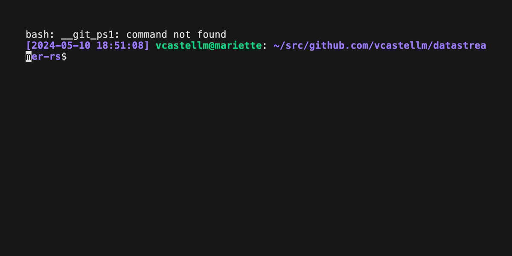

# datastreamer-rs

Efficient, fast, async [zkEVM DataStreamer](https://github.com/0xPolygonHermez/zkevm-data-streamer/) library in Rust.

## Intro

The datastreamer protocol is used by the zkEVM/Polygon CDK protocol to sync data from the trusted sequencer. Current Go implementation is used in the current Go zkevm-node/cdk-validium-node and in cdk-erigon.

This implementation is suitable to use with Reth.

## Features

- [x] Streaming client
- [x] Client demo
- [ ] Steaming server
- [ ] Server demo

## Status

This code is Alpha but and `StreamClient` is ready to use 100% compatible with the Go implementation and server.

The `StreamServer` is under development.

## Usage

See the `src/main.rs` file for a quick usage method.

